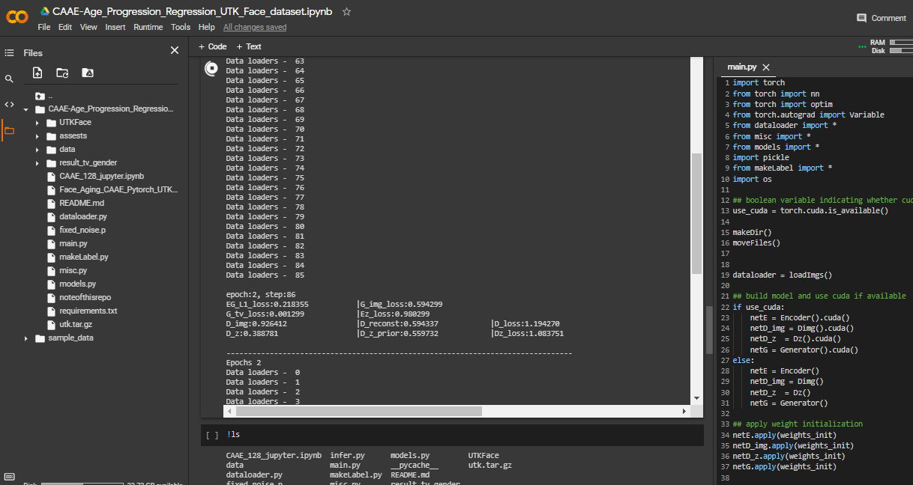
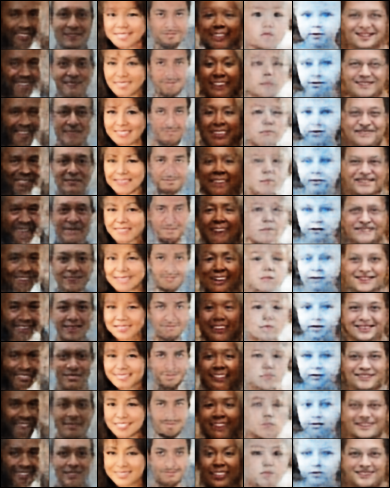

## Face Aging CAAE 


## Requirements

> pip install -r requirements.txt 

* torchvision 0.4.0
* torch 1.2.0
* [UTKFace Aligned&Cropped](https://drive.google.com/drive/folders/0BxYys69jI14kU0I1YUQyY1ZDRUE) dataset

## Colab Notebook

Training - [Colab Notebook](CAAE_Age_Progression_Regression_UTK_Face_dataset.ipynb)

Inference - [Colab Notebook]() - pending

**Snapshot**




## Usage
* git clone or download zip file of this repository
* download Aligned & Cropped version of UTKFace from [here](https://drive.google.com/drive/folders/0BxYys69jI14kU0I1YUQyY1ZDRUE)
* Install requirements
* execute main.py 
> python main.py

## Results

**UTKFace**
> rows: years of  0 ~ 5, 5 ~ 10, 10 ~ 15, 16 ~ 20, 21 ~ 30, 31 ~ 40, 41 ~ 50, 51 ~ 60, 61 ~ 70, over 70  

```
epoch:50, step:86
EG_L1_loss:0.075875           |G_img_loss:5.226651           
G_tv_loss:0.003358            |Ez_loss:0.851948
D_img:0.998970                |D_reconst:0.015672            |D_loss:0.017007               
D_z:0.435863                  |D_z_prior:0.606904            |Dz_loss:1.133016 
```
output with 1.7k images trained for 50 epochs



<br></br>

## To-do:
- [ ] Check the corretness of model 
- [ ] Write inference code with trained weights
- [ ] Release pretrained weights for this repo


## Credits
- [Age Progression/Regression by Conditional Adversarial Autoencoder](http://web.eecs.utk.edu/~zzhang61/docs/papers/2017_CVPR_Age.pdf)
- [Face-Aging-CAAE-Pytorch](https://github.com/Jooong/Face-Aging-CAAE-Pytorch)

## Other creations
- [AgeProgression-Pytorch](https://github.com/mattans/AgeProgression)
- [AgeProgression-tensorflow](https://github.com/ZZUTK/Face-Aging-CAAE)


